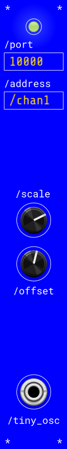

# Tiny OSC for VCV Rack

TinyOSC is a minimal VCV Rack 2 plugin for receiving one OSC value from TouchDesigner and exposing it as CV.

The module is intentionally small: one UDP OSC input path, one address filter, scale and offset controls, and one CV output. It does not send OSC from Rack.



## Module

- Direction: TouchDesigner to VCV Rack only.
- UDP port textbox, default `10000`.
- OSC address textbox, default `/chan1`.
- Accepts OSC messages whose address matches the configured address.
- Scale knob: `-10V` to `10V`, default `10V`.
- Offset knob: `-10V` to `10V`, default `0V`.
- Output formula: `output = incoming_value * scale + offset`.
- Output is clamped to `-10V..10V`.
- Data light lights up when a matching OSC message is received.

## TouchDesigner Setup

Use an OSC Out CHOP or DAT targeting the machine running Rack.

- Network address: `localhost` for same-machine testing, or the Rack machine's LAN IP from another machine.
- Port: the TinyOSC port field, default `10000`.
- Address: the TinyOSC address field, default `/chan1`.
- Send a single float channel/value when possible.

Multiple TinyOSC modules can listen on the same UDP port. Each module filters by its own OSC address.

## Build

Install or extract the VCV Rack 2 SDK, then set `RACK_DIR` to that SDK path.

```bash
export RACK_DIR=/path/to/Rack-SDK
make
```

Package a `.vcvplugin`:

```bash
make dist
```

Install into Rack's user plugin folder:

```bash
make install
```

The current downloadable build target is macOS Apple Silicon (`mac-arm64`) only. The UDP receiver uses POSIX sockets, so broader macOS/Linux support is possible later, but this project intentionally starts with a small Apple Silicon release.

## Repository Layout

- `src/` - Rack plugin and module source.
- `res/` - Rack panel SVG assets.
- `plugin.json` - Rack plugin manifest.
- `Makefile` - Standard Rack SDK plugin makefile.

## License

MIT. See `LICENSE`.
